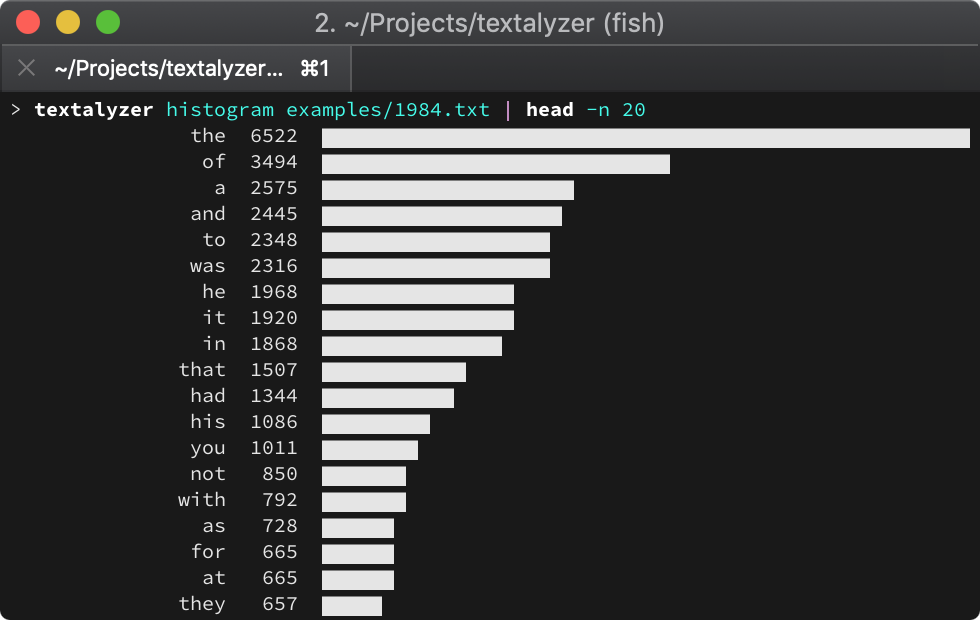

# Textalyzer

Analyze key metrics like number of words, readability, complexity, etc.
of any kind of text.




## Usage

```
textalyzer histogram <filepath>
```


## Related

- [wf] - Command line utility for counting word frequency

[wf]: https://github.com/jarcane/wf
